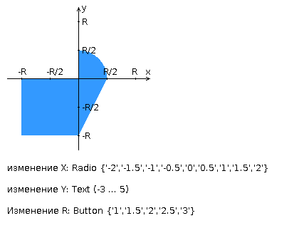

# Лабораторная работа #1 
## Вариант: 467495
Разработать FastCGI сервер на языке Java, определяющий попадание точки на координатной плоскости в заданную область, и создать HTML-страницу, которая формирует данные для отправки их на обработку этому серверу.

Параметр R и координаты точки должны передаваться серверу посредством HTTP-запроса. Сервер должен выполнять валидацию данных и возвращать HTML-страницу с таблицей, содержащей полученные параметры и результат вычислений - факт попадания или непопадания точки в область (допускается в ответе сервера возвращать json строку, вместо html-страницы). Предыдущие результаты должны сохраняться между запросами и отображаться в таблице.

Кроме того, ответ должен содержать данные о текущем времени и времени работы скрипта.
### Комментарии по выполнению ЛР:
* Требуется поднять Apache httpd веб-сервер от лица своего пользователя на гелиосе (шаблон файла конфигурации доступен для скачивания наверху страницы)
* Веб-сервер должен заниматься обслуживанием статического контента (html, css, js) и перенаправлять запросы за динамическим контентом к FastCGI серверу
* FastCGI сервер требуется реализовать на языке Java (полезная библиотека в помощь в виде jar архива доступна для скачивания наверху страницы) и поднять также на гелиосе
* __Путем обращений из JavaScript к FastCGI серверу требуется показать понимание принципа AJAX__
### Разработанная HTML-страница должна удовлетворять следующим требованиям:
* Для расположения текстовых и графических элементов необходимо использовать блочную верстку.
* Данные формы должны передаваться на обработку посредством POST-запроса.
* Таблицы стилей должны располагаться в самом веб-документе.
* При работе с CSS должно быть продемонстрировано использование селекторов потомств, селекторов дочерних элементов, селекторов идентификаторов, селекторов классов а также такие свойства стилей CSS, как наследование и каскадирование.
* HTML-страница должна иметь "шапку", содержащую ФИО студента, номер группы и новер варианта. При оформлении шапки необходимо явным образом задать шрифт (fantasy), его цвет и размер в каскадной таблице стилей.
* Отступы элементов ввода должны задаваться в процентах.
* Страница должна содержать сценарий на языке JavaScript, осуществляющий валидацию значений, вводимых пользователем в поля формы. Любые некорректные значения (например, буквы в координатах точки или отрицательный радиус) должны блокироваться.
### Условия:


## Инструкция для запуска на Гелиос
1. Соберите jar при помощи ```./gradlew jar```. В build.gradle должен быть выбран MainH.java
2. Измените httpd_HELIOS.conf под свой ИСУ вместо моего и переименуйте его, убрав "_HELIOS"
3. Закиньте все файлы на Гелиос так, чтобы у вас была такая структура:
    ```
       sXXXXXX/web-lab1
       |
       ├── .www/
       │   └── index.html
       ├── httpd-root/
       │   ├── conf/
       |   |    └──httpd.conf
       |   |
       |   ├──fcgi-bin/
       |   |    └──app.jar
       |   |
       |   └──mutex-dir/
       └── README.md
    ```
   XXXXXX везде замените на ваш ИСУ
4. Зайдите на Гелиос при помощи ssh тоннеля ```ssh -L 8811:localhost:7777 -l sXXXXXX -p 2222 se.ifmo.ru``` и вашего пароля
5. Выполните команды
    ```
    pkill -u sXXXXXX httpd
    pkill -u sXXXXXX java   
    httpd -f ~/web-lab1/httpd-root/conf/httpd.conf
    java -Xmx1g -DFCGI_PORT=7778 -jar ~/web-lab1/httpd-root/fcgi-bin/app.jar &
    ```
Если хотите другие порты, то помните что их нужно везде поменять. У меня 7777-порт для связи между Apache и FastCGI, а порт
7778-для связи между localhost и Apache.

# Вопросы к защите лабораторной работы:

1. Протокол HTTP. Структура запросов и ответов, методы запросов, коды ответов сервера, заголовки запросов и ответов.
2. Язык разметки HTML. Особенности, основные теги и атрибуты тегов.
3. Структура HTML-страницы. Объектная модель документа (DOM).
4. HTML-формы. Задание метода HTTP-запроса. Правила размещения форм на страницах, виды полей ввода.
5. Каскадные таблицы стилей (CSS). Структура - правила, селекторы. Виды селекторов, особенности их применения. Приоритеты правил. Преимущества CSS перед непосредственным заданием стилей через атрибуты тегов.
6. LESS, Sass, SCSS. Ключевые особенности, сравнительные характеристики. Совместимость с браузерами, трансляция в "обычный" CSS.
7. Клиентские сценарии. Особенности, сферы применения. Язык JavaScript.
8. Версии ECMAScript, новые возможности ES6 и ES7.
9. Синхронная и асинхронная обработка HTTP-запросов. AJAX.
10. Библиотека jQuery. Назначение, основные API. Использование для реализации AJAX и работы с DOM.
11. Реализация AJAX с помощью SuperAgent.
12. Серверные сценарии. CGI - определение, назначение, ключевые особенности.
13. FastCGI - особенности технологии, преимущества и недостатки относительно CGI.
14. FastCGI сервер на языке Java.

### Источники для подготовки
* [Ответы на вопросы TBD](https://www.youtube.com/watch?v=TEKKimEEMyM)
* [Ответы на вопросы(PHP)](https://github.com/worthant/simple-one-page-website/blob/726cfdd610064b9f9260f41cf24b76f1cd568005/theory.md)
* [Теория по билетам за весь веб(PHP)](https://github.com/band-of-four/cheatsheets/blob/master/Internet-Applications-Development/ModuleTest1Questions.md)


